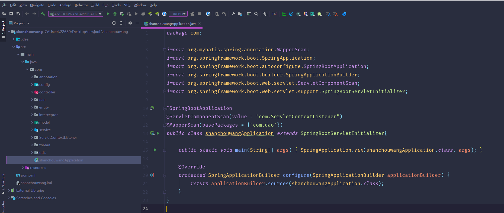
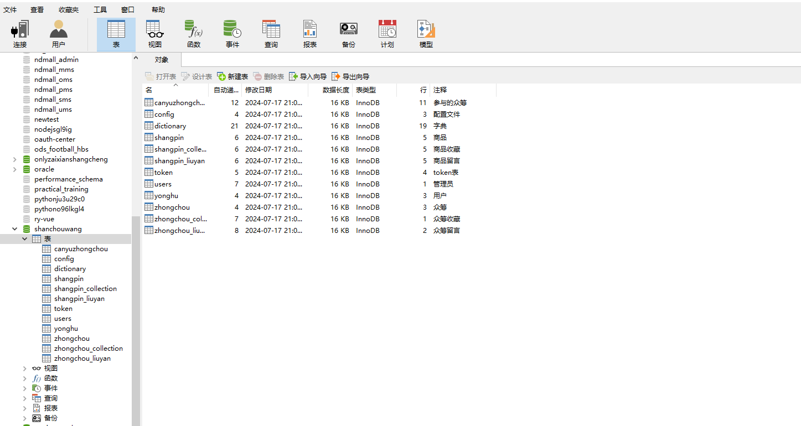
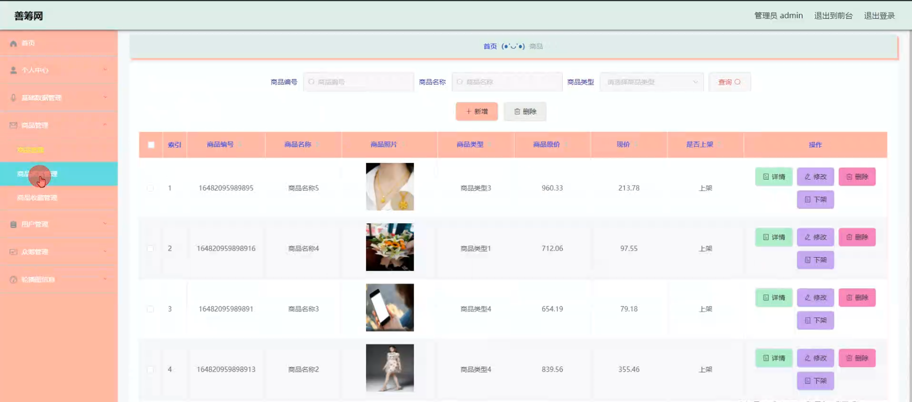
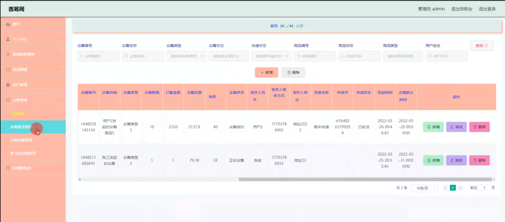
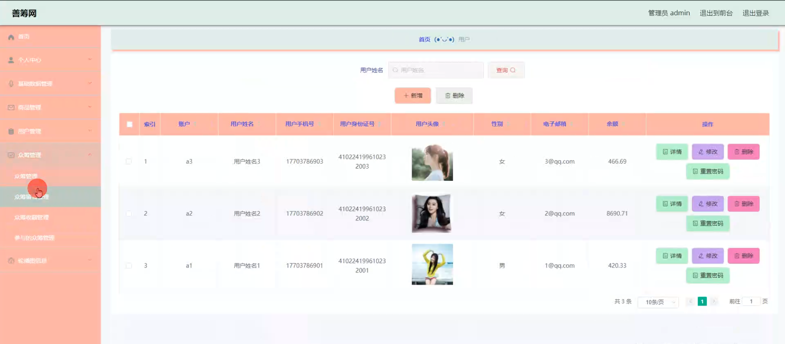

# 基于springboot的善筹网（众筹）前后台实现设计

#### 介绍

在当今互联网快速发展的背景下，众筹作为一种新兴的融资模式，逐渐受到人们的关注与青睐。善筹网是一个基于Spring Boot开发的众筹平台，旨在为用户提供一个方便、快捷、安全的众筹环境。本系统通过整合前后台功能，实现了管理员与用户两种角色的权限划分与功能管理，填补了传统众筹平台在功能多样性和用户体验上的不足，致力于解决现有众筹平台存在的信息不透明、管理混乱等问题。

#### 技术栈

后端技术栈：Springboot+Mysql+Maven

前端技术栈：Vue+Html+Css+Javascript+ElementUI

开发工具：Idea+Vscode+Navicate

#### 系统功能介绍

管理员角色  
个人中心：  
管理员可以查看和修改自己的个人信息，如姓名、联系方式等。  
提供操作日志查看功能，方便管理员追踪自己的操作历史。  
基础数据管理：  
包括对平台基础数据的维护，如分类管理、标签管理等。  
提供数据导入导出功能，便于数据的备份与迁移。  
商品管理：  
管理员可以发布、编辑、下架商品信息。  
提供商品库存、价格等详细信息的维护功能。  
用户管理：  
查看、编辑、删除用户信息，对用户进行权限分配。  
提供用户行为分析报表，帮助管理员了解用户活跃度和偏好。  
众筹管理：  
包括众筹项目的发布、编辑、审核、下架等功能。  
众筹留言管理：查看用户留言，进行回复或删除操作。  
众筹收藏管理：查看用户收藏情况，分析用户兴趣点。  
参与的众筹管理：查看用户参与众筹的记录，进行统计和分析。  
轮播图信息管理：  
管理首页轮播图，包括上传、编辑、删除轮播图内容。  
设置轮播图展示顺序和展示时间。  

用户角色  
商品模块：  
浏览商品列表，查看商品详细信息。  
进行商品搜索，根据分类、标签筛选商品。  
众筹模块：  
查看众筹项目列表，浏览项目详情。  
参与众筹，进行支付并等待项目结果。  
个人中心：  
查看和修改个人信息，如头像、昵称等。  
查看自己的众筹记录、收藏记录等。  
后台管理（仅限特定权限用户）：  
商品管理：发布、编辑自己的商品信息。  
众筹管理：  
众筹留言管理：查看和管理自己的众筹项目留言。  
众筹收藏管理：查看用户对自己项目的收藏情况。  
参与的众筹管理：查看自己参与的众筹项目状态和进度。  

#### 系统作用

善筹网通过整合众筹业务的全流程管理，不仅提升了管理员的管理效率，还为用户提供了更加便捷、透明的众筹体验。具体来说，系统的作用体现在以下几个方面：

提升管理效率：  
管理员可以方便地管理商品、用户和众筹项目，减少了人工操作的复杂性和出错率。  
提供的数据分析功能帮助管理员更好地了解用户需求和市场动态。  

增强用户体验：  
用户可以方便地浏览商品和众筹项目，参与众筹流程更加简单快捷。  
个人中心功能使用户能够方便地管理自己的信息和众筹记录。  

提高信息透明度：  
众筹项目的详细信息、留言和进度都对用户公开，增强了平台的信任度。  
用户可以实时查看自己参与的众筹项目状态和结果。  

#### 系统功能截图

代码结构

数据库表

登录

管理员端商品管理

众筹管理

前台页面首页

商品模块

众筹模块

用户管理

#### 总结

善筹网作为一个基于Spring Boot开发的众筹平台，通过细致的功能模块划分和完善的角色权限管理，实现了管理员与用户之间的有效互动和信息流通。本系统不仅填补了传统众筹平台在功能多样性和用户体验上的不足，还通过提升管理效率和增强信息透明度，为用户提供了一个更加安全、便捷的众筹环境。未来，随着技术的不断发展和用户需求的不断变化，善筹网将继续优化和完善功能，致力于成为众筹领域的佼佼者。

#### 使用说明

创建数据库，执行数据库脚本 修改jdbc数据库连接参数 下载安装maven依赖jar 启动idea中的springboot项目

前台登录页面
http://localhost:8080/shanchouwang/front/index.html

后台登录页面
http://localhost:8080/shanchouwang/admin/dist/index.html

管理员				账户:admin 		密码：admin

用户				账户:a1 		密码：123456